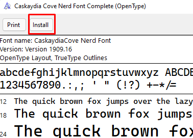
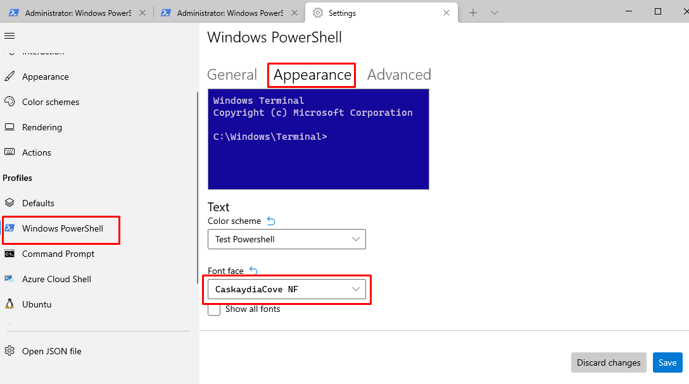

# My powershell terminal

A brief description on how to install my custom powershell terminal.

## Installation

Clone this repository to start with the installation.

### Install font

It is required to have a nerd font to use all the icons. Here, I am using **Caskaydia Font**. To install it, open the files and click install as shown in the image:



Then, on windows terminal, update your Powershell profile to use this font:



### Install Terminal-Icons

This module displays directory listing color and icons.

```ps1
Install-Module -Name Terminal-Icons -Repository PSGallery
```

### Install oh-my-posh

First of all we need [oh-my-posh](https://ohmyposh.dev/).

```ps1
winget install JanDeDobbeleer.OhMyPosh
```

Run the **install.ps1** script to create the profile and add the oh-my-posh prompt and add the alias.
Then, reload the terminal to reload $PATH and apply changes.