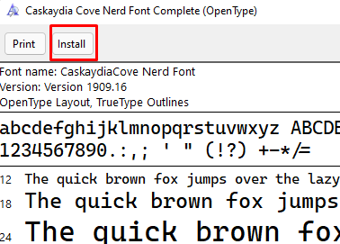

# My powershell terminal

A brief description on how to install my custom powershell terminal.

## Installation

You can either clone this repository, or run the bootstrap script directly from GitHub without cloning.

### Quick install (no clone)

Run this one-liner in PowerShell. It downloads the repository to a temporary folder, installs the base tools with winget (`tools-winget.ps1`), the PowerShell modules (`tools-ps.ps1`) and the Chocolatey packages (`tools-choco.ps1`), runs `install.ps1`, and removes the temporary files afterwards:

```ps1
irm https://raw.githubusercontent.com/DrDonoso/PowershellTerminal/main/bootstrap.ps1 | iex
```

> Note: the bootstrap script now installs the Nerd Font, PowerShell modules and the rest of the prerequisites automatically. The sections below document what it does and how to install each piece manually if you prefer.

### Execution Policy

Maybe there will be some problems with the executions policies, to solve it run:

```ps1
Set-ExecutionPolicy Unrestricted
```

### Install font

It is required to have a nerd font to use all the icons. Here, I am using **Caskaydia Font**. To install it, open the files and click install as shown in the image:



Then, on windows terminal, update your Powershell profile to use this font:


### Install Terminal-Icons

This module displays directory listing color and icons.

```ps1
Install-Module -Name Terminal-Icons -Repository PSGallery
```

### Install PSReadLine

We will need PSReadLine for autocompletion and predictive IntelliSense.
Install it with:

```ps1
Install-Module PSReadLine -Force
```

### Install PSFzf

[PSFzf](https://github.com/kelleyma49/PSFzf) is a [fzf](https://github.com/junegunn/fzf) wrapper.

First, install fzf with chocolatey or scoop:

```ps1
choco install fzf
```

And then, install PSFzf:

```ps1
Install-Module PSFzf
```

### Install gawk

```ps1
choco install gawk
```

### Install oh-my-posh

We need [oh-my-posh](https://ohmyposh.dev/).

```ps1
winget install JanDeDobbeleer.OhMyPosh
```

Then, run the **install.ps1** script (or the [Quick install](#quick-install-no-clone) one-liner) to create the profile, add the oh-my-posh prompt and the aliases.
Reload the terminal to reload $PATH and apply changes.
