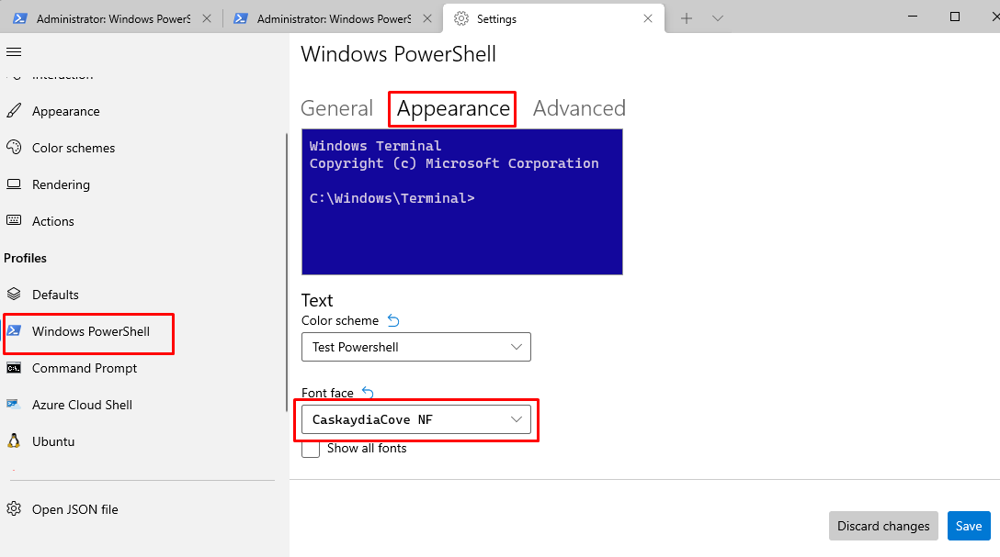

# My powershell terminal

A brief description on how to install my custom powershell terminal.

## Installation

You can either clone this repository, or run the bootstrap script directly from GitHub without cloning.

### Quick install (no clone)

Run this one-liner in PowerShell. It downloads the repository to a temporary folder, installs the base tools with winget (`tools/winget.ps1`), the PowerShell modules (`tools/ps.ps1`) and the Chocolatey packages (`tools/choco.ps1`), runs `install.ps1`, and removes the temporary files afterwards:

```ps1
irm https://raw.githubusercontent.com/DrDonoso/PowershellTerminal/main/bootstrap.ps1 | iex
```

The scripts install all the required tools, PowerShell modules and Chocolatey packages, install the Caskaydia Nerd Font, and create the PowerShell profile with the oh-my-posh prompt and the aliases.

### Execution Policy

Maybe there will be some problems with the executions policies, to solve it run:

```ps1
Set-ExecutionPolicy Unrestricted
```

### Set the terminal font

Once everything is installed, update your Windows Terminal PowerShell profile to use the **CaskaydiaCove Nerd Font** so all the icons render correctly:



Reload the terminal to reload $PATH and apply the changes.
